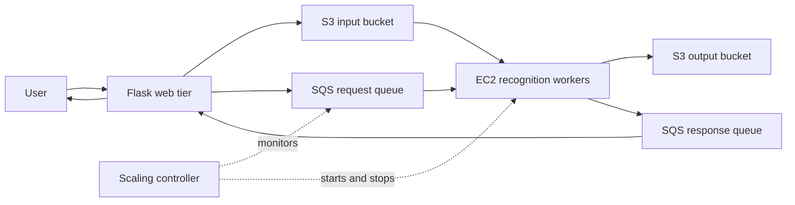

# EC2 Face Recognition Service

A Python face-recognition workflow using a Flask web tier, Amazon S3, Amazon SQS, and EC2 inference workers. Developed for CSE 546 Cloud Computing, Project 1 Part II.

## How it works

1. The Flask endpoint accepts an image, stores it in S3, and sends a request to SQS.
2. An EC2 worker downloads the image and runs the recognition model.
3. The worker stores the result in S3 and sends a response through a second SQS queue.
4. The web tier correlates the response with the request and returns the result.

A separate controller monitors queue depth and starts or stops pre-provisioned EC2 workers, with a configured maximum of 15 instances. It does not create instances or provision infrastructure.

## Architecture


[](https://github.com/monisha-krishnamurthy/ec2-face-recognition/actions/workflows/python-check.yml)

## Source layout

- `web-tier/server.py` — HTTP uploads and response coordination.
- `web-tier/controller.py` — queue-based EC2 start/stop controller.
- `app-tier/backend.py` — image processing and result delivery.
- `app-tier/face_recognition.py` — import-safe adaptation of the VISA Lab MIT-labeled course inference code.

## Python dependencies

From the repository root, create and activate a virtual environment:

```bash
python3 -m venv .venv
source .venv/bin/activate
python -m pip install -r web-tier/requirements.txt
```

On an EC2 worker, install `app-tier/requirements.txt`. The local `face_recognition.py` adapter supplies `face_match`; the similarly named PyPI package is not required.

Dependency lists reflect source imports and are not a tested version lock. Installing them does not provision AWS resources or supply the missing model assets.

## Deployment prerequisites

This repository contains application source from the course submission. It is not a self-contained deployment package.

- Install Flask and boto3 for the web tier; install the recognition model's dependencies on workers.
- Download the course [data.pt reference embeddings](https://github.com/nehavadnere/CSE546-FALL-2025/blob/model/data.pt) into `app-tier/data.pt`. This asset is excluded from Git. Pretrained VGGFace2 weights are downloaded on first model use.
- Create input/output S3 buckets, request/response SQS queues, and an EC2 worker pool with the expected Name tags.
- Update region, bucket, queue, and instance-name constants in the source to match your environment.
- Configure AWS access through IAM roles or your local AWS credential provider; credentials are excluded from this repository.
- Arrange for workers to start `backend.py` at boot before using the scaling controller.

The controller has `DRY_RUN = False`; running it can start and stop matching EC2 instances.

## Scope and validation

The source was checked for Python syntax. End-to-end AWS behavior and performance have not been revalidated for this repository. The web tier uses in-memory response coordination, so horizontal web-tier scaling would require additional coordination.

Course-provided model assets, credentials, and assignment PDFs are not bundled.

Local evaluation matched the supplied labels for all 100 course test images, with zero processing errors. This evaluated face detection, JPEG conversion, and recognition locally; AWS messaging and deployment were not tested. The result is specific to this dataset and does not establish accuracy on unseen images.
## Local recognition check

With the app-tier dependencies installed and `app-tier/data.pt` present:

```bash
python app-tier/face_recognition.py /path/to/test-image.jpg
```

The adapter preserves the course preprocessing, loads models lazily, honors an optional `--data` path, and returns `No-Face` when detection finds no face. Reference files are loaded with `weights_only=True`. Nearest-reference matching does not reject unknown identities.

Local checks verified safe import, 90 valid reference embeddings, explicit model-path handling, and blank-image handling. The course sample `test_000.jpg` matched its documented label, `Paul`. These checks used the existing Python 3.11 recognition environment; EC2, S3, SQS, and worker lifecycle behavior were not tested.

Adapted from [VISA Lab course inference code](https://github.com/nehavadnere/CSE546-FALL-2025/blob/model/face_recognition.py), marked Copyright 2025, VISA Lab, MIT. Attribution is preserved in the module.

## Worker coordination tests

Run without AWS credentials or model dependencies:

```bash
python -m unittest discover -s tests -v
```

Mock-based tests verify request ID propagation, storage and response ordering, acknowledgment after successful processing, and no acknowledgment when download, recognition, storage, or response delivery fails. Importing the worker does not start polling; running `python app-tier/backend.py` starts the AWS worker. The GitHub workflow runs these tests alongside syntax and dependency checks.

These tests validate application coordination, not real S3/SQS behavior. Processing exceptions still propagate and stop the worker; retries require worker restart and SQS visibility timeout expiry. Duplicate delivery and idempotency are not addressed by this refactor.
